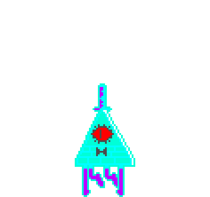

# Bill Cipher — Desktop Companion for macOS



[](https://github.com/Jasonilization/bill-cipher-companion/releases)
[](https://github.com/Jasonilization/bill-cipher-companion/releases)
[](https://swift.org)
[](LICENSE)
[](https://github.com/Jasonilization/bill-cipher-companion/actions)

Bill Cipher lives on your desktop. A hand-drawn **380-frame pixel-art sprite rig** of Gravity Falls' dream demon — built natively in Swift with AppKit + SpriteKit — that roams your screen, reacts to what you're doing, watches the weather, nags your habits, and chats back through his own speech bubbles (powered by an embedded ChatGPT page).

> *Unofficial, non-commercial fan project. Bill Cipher and Gravity Falls are © Disney. Not affiliated with or endorsed by Disney.*

---

## What he does

- **Studies your apps (first-run personalization)** — on first launch, Bill offers to use his own ChatGPT connection to write himself commentary for the apps actually installed on your Mac: a morning line, a midday line, an afternoon line and a night line for each app, plus transition quips for switching between your most-used pairs. All in his voice, all referencing Gravity Falls lore, all generated on your machine at the moment you're ready to use it — and merged into his live dialogue immediately, batch by batch.
- **Reads the sky** — pulls local weather (Open-Meteo, keyless) every five minutes using the radar-based nowcast, so he announces rain *while it's actually starting to rain*, and folds today's conditions into his chat context: *"outside the window, the weather is raining, 14°C."*
- **Roams the whole screen** — walks the floor, climbs windows, perches on them, falls with gravity, and gets shoved aside when you move windows under him. Shooting animations keep him anchored where he was standing.
- **Knows what you're up to** — reads your focused window's title (via Accessibility) and, if you opt in, can read the window contents on-device (Vision OCR) to tell whether your assignments are actually done.
- **Talks to you** — right-click Bill → **Talk** (or the global hotkey, or the menu bar). You type in a pixel speech bubble; Bill answers in his own. Conversations scroll instead of clipping, never end up off-screen, accept `Shift+Return` for paragraphs, and always land pinned to the newest message.
- **Actually chats** — replies come from a real ChatGPT session in an embedded WebKit view, with a summary of your recent Mac activity *and* the current weather folded into the first message of each conversation.
- **Never runs out of things to say** — a daily background prompt asks ChatGPT for fresh, activity-relevant quips and merges them into the local dialogue pools; the static half of his dialogue now leans properly into the canon (turn the volume up and see what he says about the party at the Shack).
- **Has moods** — poke him too much and watch. Idle bobbing, thinking, talking, celebrating, meltdowns, shadow hands — 30fps while active, a calm 12fps when ambient.
- **Study mode & habit nagging** — a focused-work mode he guards, plus gentle (eventually less gentle) nudges about the habits you set in Settings.
- **Menu bar citizen** — a proper `LSUIElement` accessory app: no Dock icon, no focus stealing, lives quietly in the menu bar. Trust no one; trust the eye.

## Requirements

| | |
|---|---|
| **OS** | macOS 26 (Tahoe) or newer — he uses Liquid Glass, the new `WebView` API, and Vision OCR |
| **Chat** | a logged-in [chatgpt.com](https://chatgpt.com) account (Bill opens his own browser window for the one-time sign-in) |
| **Perms** | Accessibility (window titles), optional Screen & Audio capture (OCR) — asked for on first use |

**Platforms:** macOS today. Windows and Linux: coming soon — check the [platforms page](https://jasonilization.github.io/bill-cipher-companion/#platforms) for the plan.

## Install

1. Download **`Bill-macOS.dmg`** from the [latest release](https://github.com/Jasonilization/bill-cipher-companion/releases) (a plain `Bill-macOS.zip` is there too).
2. Open the DMG and drag **Bill** onto the **Applications** shortcut right beside him.
3. First launch: **right-click → Open** (the app is ad-hoc signed, not notarized).
4. Look at your menu bar. He's already watching your desktop — and in a moment he'll offer to learn your apps.

## Build from source

```bash
git clone https://github.com/Jasonilization/bill-cipher-companion.git
cd bill-cipher-companion
swift build                # debug
./Scripts/bundle.sh release  # → Bill.app, ad-hoc signed
```

No Xcode project — a pure SwiftPM package (`swift-tools-version: 6.2`, `.macOS(.v26)`).

## How it's put together

```
Sources/Bill/
├── Animation/        SpriteKit rig, state machine, 380-sprite catalog, FX library
├── App/              NSApplication bootstrap, menu-bar + monitor wiring
├── Awareness/        Focused-window titles + on-device OCR (Vision)
├── CharacterEngine/  Bark lines, reactions, habit nagging
├── Chat/             WebKit/ChatGPT bridge, injected JS, message relay
├── Debug/            Dialogue refresh log window
├── Dialogue/         Local dialogue pools, time-of-day lines
├── Memory/           Recent-activity summaries (context for chat)
├── Personalization/  First-run ChatGPT setup: per-app, per-time, transition lines
├── Roaming/          Desktop physics: ledges, gravity, window-climbing
├── StudyMode/        Focus enforcement
├── SystemMonitor/    Battery / network / CPU / idle / volume / weather
└── UI/               Character window, pixel chat, personalization setup, settings, hotkey
```

## License

Code is released under the [MIT License](LICENSE). The character Bill Cipher and all Gravity Falls references belong to Disney; the pixel sprites here are original fan art made for this project.

---

*Reality is an illusion, the universe is a hologram, buy gold, bye!*
